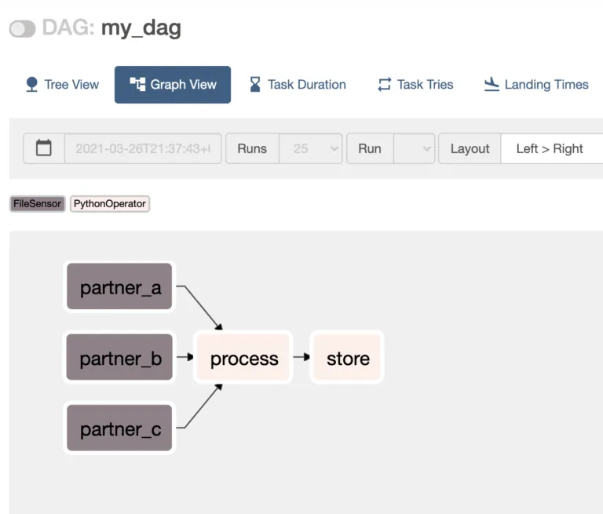

## Sensores

Sensores são utilizados para aguardar até uma ação ocorrer, antes de ir para a próxima tarefa.
Verificar o script [sensor.py](./dags/sensor_and_bashOperator.py) para ver como deve ser desenvolvido.

Notas
  1. Na interface, selecionar Admin -> Connections
     - Os dados são encriptados no banco, mas visualizados na interface.
  2. O campo *Connection id* deve ter o mesmo valor informado no script.
  3. No caso de arquivos de sistema, a *connection type* deve ser *File(path)*
  4. Extra: Espera um JSON. No caso do sistema de arquivos:

    {"path":"/tmp"}
   
  5. Por padrão, os sensores avaliam as conexões a cada 30 segundos, para alterar esse valor, deve-se usar o parâmetro *poke_interval*

Airflow traz diferentes sensores, aqui está uma lista não exaustiva dos mais usados:

- O FileSensor : Aguarda que um arquivo ou pasta chegue em um sistema de arquivos.
- O S3KeySensor : espera que uma chave esteja presente em um bucket do S3.
- O SqlSensor : Executa uma instrução sql repetidamente até que um critério seja atendido.
- O HivePartitionSensor : Aguarda que uma partição apareça no Hive.
- O ExternalTaskSensor : aguarda a conclusão de um DAG diferente ou uma tarefa em um DAG diferente para uma data de execução específica. (Muito útil esse 🤓)
- O DateTimeSensor : Aguarda até a data e hora especificada (útil para adicionar algum atraso aos seus DAGs)
- O TimeDeltaSensor : Aguarda um timedelta após a execução da tarefa + intervalo de agendamento (parece semelhante ao anterior, não?)

### Tempo limite do sensor de airflow
Sempre, Sempre defina um tempo limite significativo para seus sensores. Sempre. Basicamente, ele deve ser menor que o intervalo de agendamento do seu DAG e corresponde ao intervalo de tempo no qual você espera ver sua condição ser atendida. Por exemplo, se seu DAG for executado uma vez por dia às 8h e seus arquivos devem chegar às 08h10, um tempo limite definido como 30 minutos pode ser uma boa ideia. Isso evitará o problema do Sensor Deadlock.

``` bash
waiting_for_file = FileSensor(
task_id='waiting_for_file',
poke_interval=30,
timeout=60 * 30
)
```

### Modos de Sensor
Um sensor tem dois modos. “poke”, que é o modo padrão, significa que quando um sensor é executado, ele ocupa um slot durante todo o tempo de execução e dorme entre os pokes. 

Se você configurar seu sensor para o modo “rescheduler”, ele liberará o slot quando a condição/critério não for atendido e será reprogramado posteriormente. 

### E se um sensor de fluxo de ar expirar
É ótimo saber que você pode definir um tempo limite para seus sensores, mas seria melhor se você soubesse como agir em seguida. Bem, boas notícias! Você pode definir uma função de retorno de chamada caso um operador falhe. Deixe-me mostrar-lhe um exemplo:
``` bash
def _failure_callback(context):
  if isinstance(context['exception'], AirflowSensorTimeout):
  print(context)
  print("Sensor timed out")
with DAG(...) as dag:
  waiting_for_file = FileSensor(
  task_id='waiting_for_file',
  poke_interval=120,
  timeout=10,
  mode="reschedule",
  on_failure_callback=_failure_callback
  )
``` 
No código acima, assim que seu FileSensor expirar, a função _failure_callback será chamada com o objeto de contexto da instância da tarefa fornecido no parâmetro. Este objeto de contexto contém muitas informações úteis sobre seu dag, tarefa etc. Nesse caso, você pode verificar a chave “exceção” e filtrá-la. Se a exceção for igual a AirflowSensorTimeout, seu Sensor expirou, portanto, faça o que quiser em seguida.

### Falha suave ou pule seu sensor
Uma vez que o tempo limite ocorre, você tem a opção de marcar o sensor como com falha ou como ignorado.

Escolher um ou outro realmente depende do seu caso de uso. Por exemplo, vamos ter vários sensores esperando por arquivos diferentes e se um arquivo não estiver disponível você ainda deseja processar os outros, pular esse sensor pode ser uma boa ideia, pois não é uma “falha” real, não é crítico para seu DAG.

Aqui está um exemplo completo:

``` bash
from airflow import DAG
from airflow.operators.python import PythonOperator
from airflow.sensors.python import PythonSensor
from airflow.exceptions import AirflowSensorTimeout
from datetime import datetime
default_args = {
'start_date': datetime(2021, 1, 1)
}
def _done():
pass
def _partner_a():
return False
def _partner_b():
return True
def _failure_callback(context):
if isinstance(context['exception'], AirflowSensorTimeout):
print(context)
print("Sensor timed out")
with DAG('my_dag', schedule_interval='@daily', default_args=default_args, catchup=False) as dag:
partner_a = PythonSensor(
task_id='partner_a',
poke_interval=120,
timeout=10,
mode="reschedule",
python_callable=_partner_a,
on_failure_callback=_failure_callback,
soft_fail=True
)
partner_b = PythonSensor(
task_id='partner_b',
poke_interval=120,
timeout=10,
mode="reschedule",
python_callable=_partner_b,
on_failure_callback=_failure_callback,
soft_fail=True
)
done = PythonOperator(
task_id="done",
python_callable=_done,
trigger_rule='none_failed_or_skipped'
)
[partner_a, partner_b] >> done
```

temos:

Observe a regra de gatilho da tarefa feita para dizer que todos os pais não falharam e pelo menos um dos pais foi bem-sucedido.


